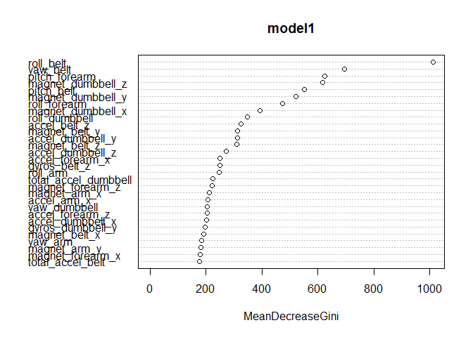

# Human Activity Recognition Prediction
Sharath G  
April 26, 2015  


```
## Loading required package: lattice
## randomForest 4.6-10
## Type rfNews() to see new features/changes/bug fixes.
```

###Background###
In this project, we build a model to accuractely  classify activities in the 'human activity recognition' data set.
This human activity recognition research has traditionally focused on discriminating between different activities, i.e. to predict "which" activity was performed at a specific point in time (like with the Daily Living Activities dataset above). Six young health participants were asked to perform one set of 10 repetitions of the Unilateral Dumbbell Biceps Curl in five different fashions: exactly according to the specification (Class A), throwing the elbows to the front (Class B), lifting the dumbbell only halfway (Class C), lowering the dumbbell only halfway (Class D) and throwing the hips to the front (Class E).Class A corresponds to the specified execution of the exercise, while the other 4 classes correspond to common mistakes.

More information is available from the website here: http://groupware.les.inf.puc-rio.br/har (see the section on the Weight Lifting Exercise Dataset)

###Loading the dataset###


```r
train <- read.csv("C:\\Users\\sharathlives\\Desktop\\R_files\\data\\pml-training.csv", na.strings=c("NA","#DIV/0!",""))
test <- read.csv("C:\\Users\\sharathlives\\Desktop\\R_files\\data\\pml-testing.csv", na.strings=c("NA","#DIV/0!",""))
dim(train)
dim(test)
```

###Clean the Data###

First, we remove columns that we don't need for the analysis. 


```r
train <- train[, -c(1:7)]
test <- test[, -c(1:7)]
dim(train)
dim(test)
```

Next, remove columns that have more than 50% NA's. First duplicate the dataset. Then, for every column in train that has more than 50% NA's compare that column name with train2 and remove that column from train2.


```r
train2 <- train 
for(i in 1:length(train)) { 
  if( sum( is.na( train[, i] ) ) /nrow(train) >= .5 ) { 
    for(j in 1:length(train2)) {
      if( length( grep(names(train[i]), names(train2)[j]) ) ==1)  { 
        train2 <- train2[ , -j] 
      }   
    } 
  }
}
```

Look for near zero variance variables. Tried removing some variables with low variance but does not affect the model.

```r
myDataNZV <- nearZeroVar(train2, saveMetrics=TRUE)
```

Partition the dataset to 80:20 to create validation set. I don't perform cross-validation because I get good results by keepong it simple. 

```r
partition <- createDataPartition(y = train2$classe, p = 0.8, list = FALSE)
trainMain <- train2[partition, ]
trainTest <-  train2[-partition, ]
dim(trainMain)
dim(trainTest)
```


###Build the model###
We use the random forest model. This gives better accuracy than CART. As mentioned above, there is no need to perform cross-validation. Here is the code for reference for 4 fold cross-validation.  
model1 <- train(classe ~., data = trainMain, method = "rf", prox = TRUE, 
               trControl = trainControl(method = "cv", number = 4, allowParallel = TRUE))

```r
model1 <- randomForest(classe ~., data = trainMain)
varImpPlot(model1)
```

 

Now, test for insample error on the validation set. We get very good results with an accuracy of over 99%.

```r
predictMain <- predict(model1, trainTest, type = "class")
confusionMatrix(predictMain, trainTest$classe)
```

```
## Confusion Matrix and Statistics
## 
##           Reference
## Prediction    A    B    C    D    E
##          A 1115    7    0    0    0
##          B    1  752    3    0    0
##          C    0    0  681    5    0
##          D    0    0    0  638    0
##          E    0    0    0    0  721
## 
## Overall Statistics
##                                           
##                Accuracy : 0.9959          
##                  95% CI : (0.9934, 0.9977)
##     No Information Rate : 0.2845          
##     P-Value [Acc > NIR] : < 2.2e-16       
##                                           
##                   Kappa : 0.9948          
##  Mcnemar's Test P-Value : NA              
## 
## Statistics by Class:
## 
##                      Class: A Class: B Class: C Class: D Class: E
## Sensitivity            0.9991   0.9908   0.9956   0.9922   1.0000
## Specificity            0.9975   0.9987   0.9985   1.0000   1.0000
## Pos Pred Value         0.9938   0.9947   0.9927   1.0000   1.0000
## Neg Pred Value         0.9996   0.9978   0.9991   0.9985   1.0000
## Prevalence             0.2845   0.1935   0.1744   0.1639   0.1838
## Detection Rate         0.2842   0.1917   0.1736   0.1626   0.1838
## Detection Prevalence   0.2860   0.1927   0.1749   0.1626   0.1838
## Balanced Accuracy      0.9983   0.9948   0.9970   0.9961   1.0000
```

Now, test the model on the test set

```r
predictTest = predict(model1, test, type = "class")
```

###Create function to generate the predictions###

```r
pml_write_files = function(x){
  n = length(x)
  for(i in 1:n){
    filename = paste0("problem_id_",i,".txt")
    write.table(x[i],file=filename,quote=FALSE,row.names=FALSE,col.names=FALSE)
  }
}
```
